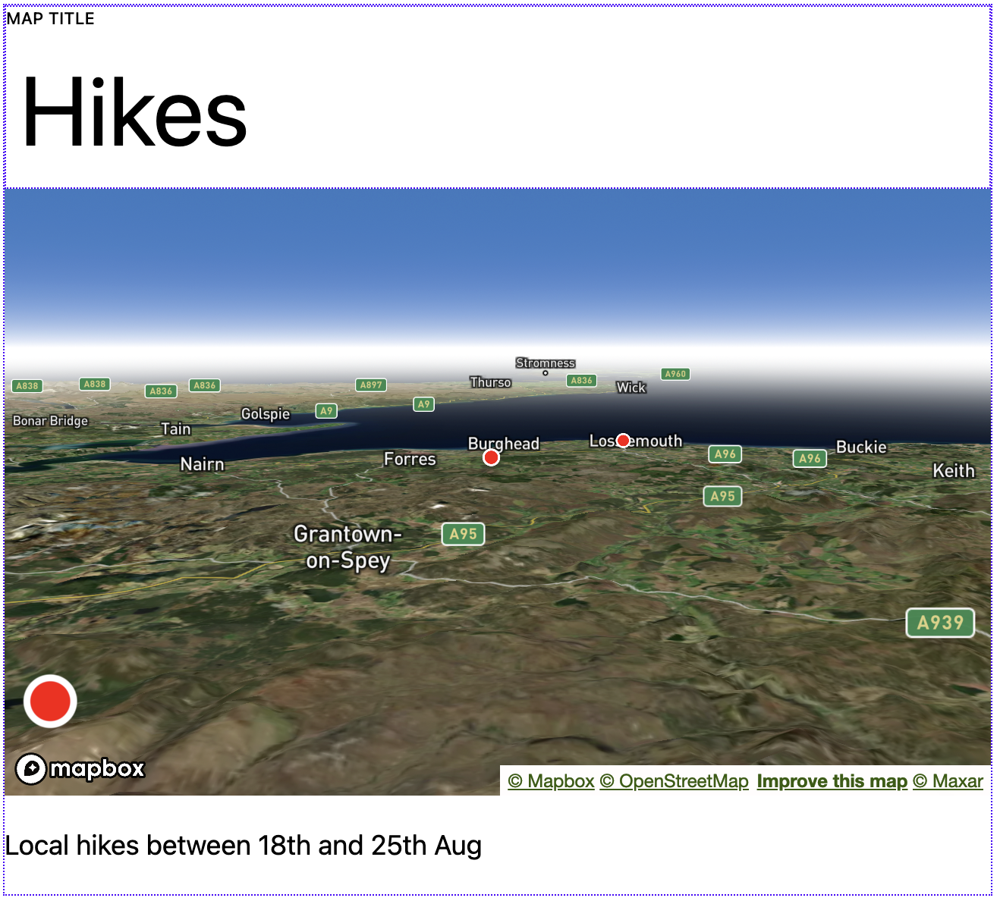

# Map Garmin Activities Block

## Screenshots

  
Editor view showing start locations

  

  
Full settings sidebar

  

  
Settings sidebar showing GPX option

  

  
Plugin sidebar showing Mapbox key and Garmin login detail fields

  

  
Map showing a GPX route

  

  
Activity start location info box for private activity

  

  
Activity start location info box for public activity

  

## About

Display start locations and GPX routes from your Garmin-recorded outdoor activities.

This block allows you to set a date range and select specific Garmin-recorded outdoor activities (eg. running, walking) - the start locations for those activities will then be overlaid on a Mapbox map as beacons with clickable info boxes. If the activity is public it will link to the full Garmin information for that activity, otherwise the popup will include the date, distance travelled and moving time.

If you set a 'to' date in the future, those activities will automatically show up on the map after you complete each.

Customizations available include marker (beacon) color, map border color, map border padding, as well as activity type and distance emasurement

This block also allows you to upload a GPX file to the media library and the route will display on a Mapbox map. Customizations include the ability to change the track color, track thickness, colour and zoom. Custom

Customizations in both cases include the map style, as well as zoom, pitch, bearing, longitude and latitude which is only relevant for initial map load (also useful if you only want to display a map with no GPX or live data).

## Usage

- You need a Mapbox account and access token which you can get at https://mapbox.com 
- Clone the project in your development environment locally: `git clone https://github.com/coder-karen/map-garmin-activities.git`
- To add the dependencies and built files run `npm install && npm run build` from the directory where you've cloned the project
  - Build requirements include [Node.js](https://nodejs.org) v 18.13.0 or later, [npm](https://www.npmjs.com/get-npm) v 8.19.3 or later, and [Composer](https://getcomposer.org/) v 2.4.4 or later
  - For using in production, after building locally run `rm -r node_modules && npm install --omit=dev` to remove the node modules folder and install only non-development related dependencies, then zip / transfer the plugin as needed
- Once the plugin is added to your site and activated, add your Mapbox access token in the plugin sidebar
- Add your Garmin account username and password beneath that if you want to use the 'show start locations' option
- Add the block to your post or page, then set map and display options from the setting sidebar

## Known Issues / Limitations

- This is still a work in progress
- Only one map to be displayed per page or post
- Only one activity type per map
- Some setting selections require a page refresh after saving for the changes to be visible (activity type, distance measurement and date range, as well as plugin sidebar fields - Mapbox token and Garmin login details)
- If using this plugin in production, the server you are hosting your site on needs to have cURL enabled (you may encounter a Garmin authentication issue otherwise). Converting the cURL requests to WordPress appropriate alternatives such as `wp_remote_get` would be an ideal next step for future development of this plugin

## Third party code / service usage

The code that enables the live data connection to Garmin is based upon a stripped down version (with minor changes) of files shared here: https://github.com/10REM/php-garmin-connect (see [license](https://github.com/10REM/php-garmin-connect/blob/master/LICENSE)). See the `garmin-connect` directory in this repository for the relevant files, as well as `garmin-connect.php`

The GPX functionality is thanks to the @tmcw/togeojson NPM package available here: https://www.npmjs.com/package/@tmcw/togeojson

## License

Map Garmin Activities is licensed under the GPL v2 or later. A copy of the license is included in the root of the plugin’s directory.